# Comment créé une machine virtuelle ?

Voici un guide très rapide de l'instalation d'une machine virtuelle Ubuntu avec Oracle Virtualbox.

-----

## Création de la machine :

1. Sur VirtualBox on va dans la section outils et on clique sur Ajouter.
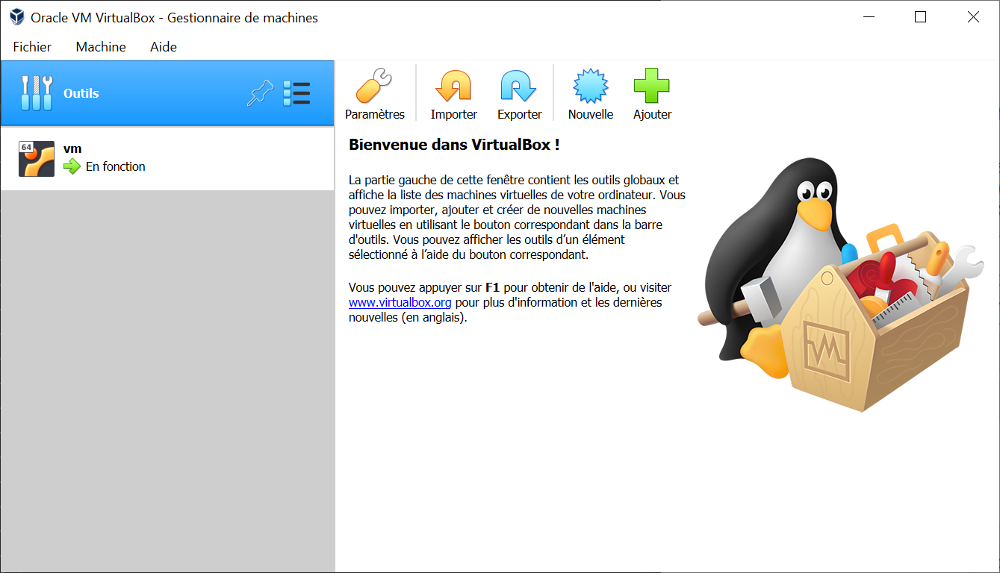

2. On lui donne un nom, un emplacement et on choisit quel OS on souaite installer.

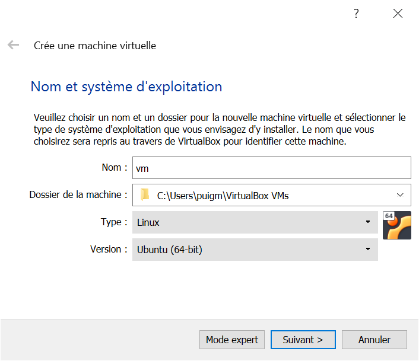

1. On choisit la memoire vive (RAM) que l'on souaite lui alouer, il est recomandé au moins 2048 Mo, mais plus il y a de RAM moins on sera limité par les performance de la machine virtuelle.

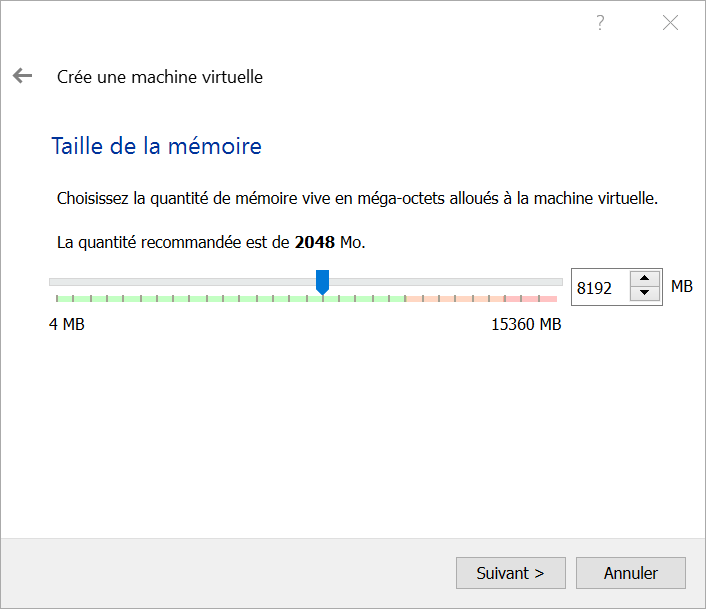

4. On lui créé un disque dur vituel.

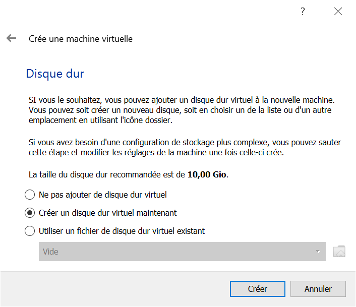

5. On choisit un disque en VDI.

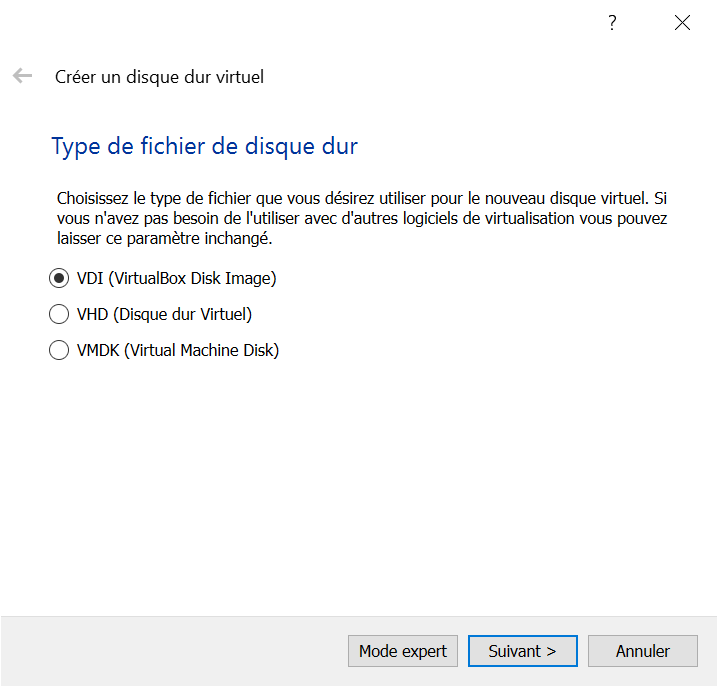

6. On le met en Dynamiquement alloué pour ne pas avoir tout le temps 10 Go en moins sur son disque dur.

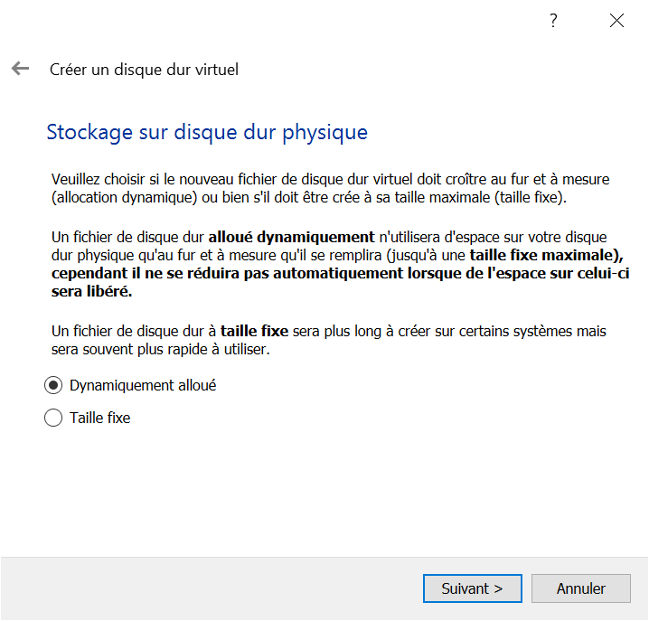

7. On choisit l'emplacement de création du disque dur et sa taille.

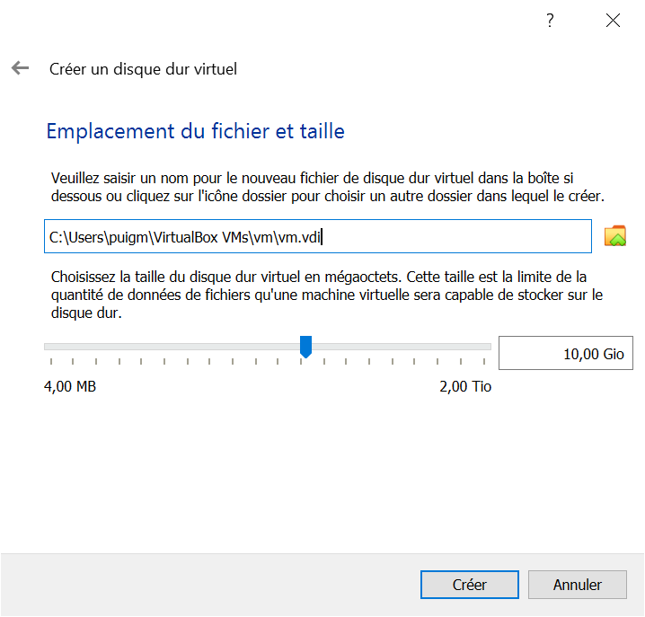

8. On choisit un image que l'on peut télécharger sur le site du système d'exploitation.

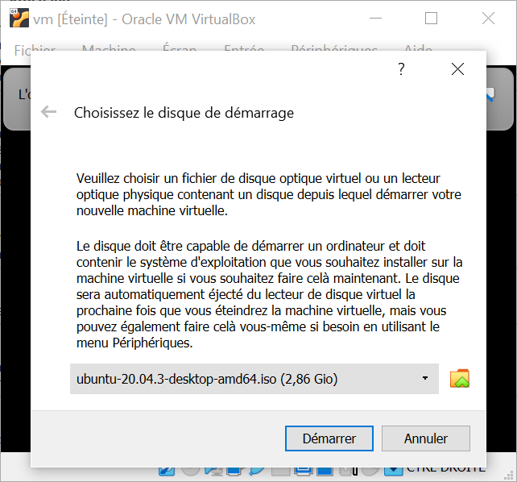

1.  Suite à tout cela, on lance enfin notre machine et on attend que la fenêtre d'instalation s'affiche.

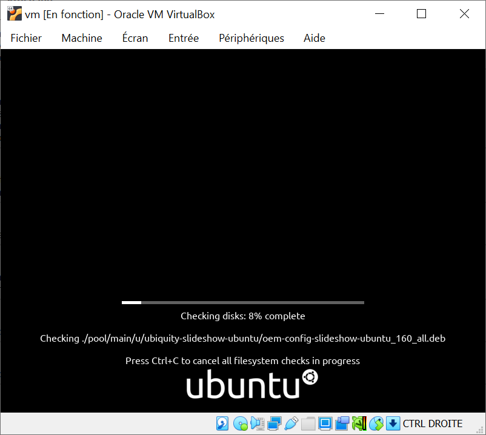

10.  Une fois sur l'instalateur on choisi "Install Ubuntu" pour l'instaler et on choisi la langue qui nous convient.

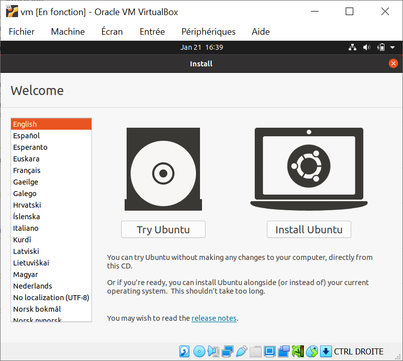

11. On choisi la disposition du clavier correspondant au notre.

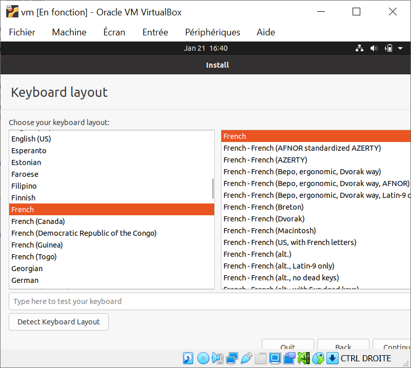

12. On choisi le mode d'instalation on peut tout decocher et choisir "minimal installation" pour une instalation plus rapide et légère. Dans notre cas si on le veut on faire comme dans l'exemple.

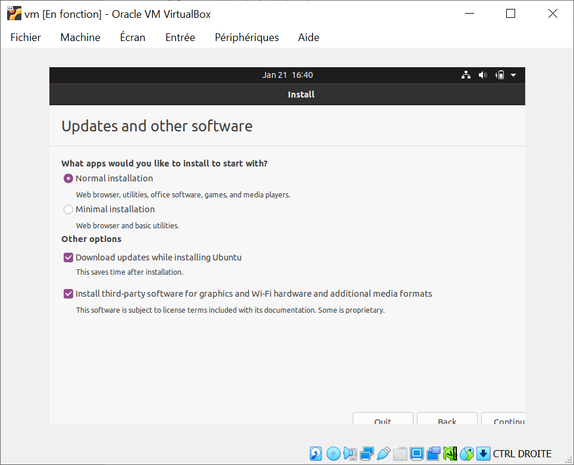

13. On choisit la première option mais cela n'a pas grande importance vue que l'on est sur un disque virtuel.

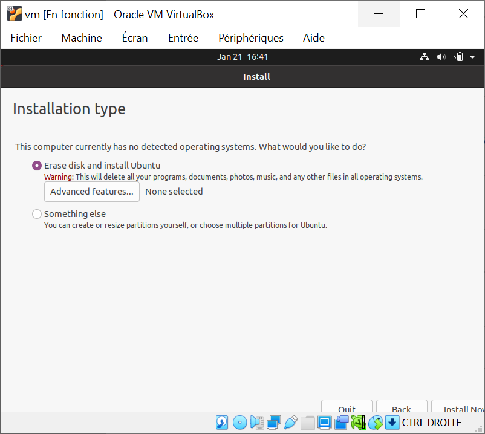

1.  On choisi notre fuseau horaire.

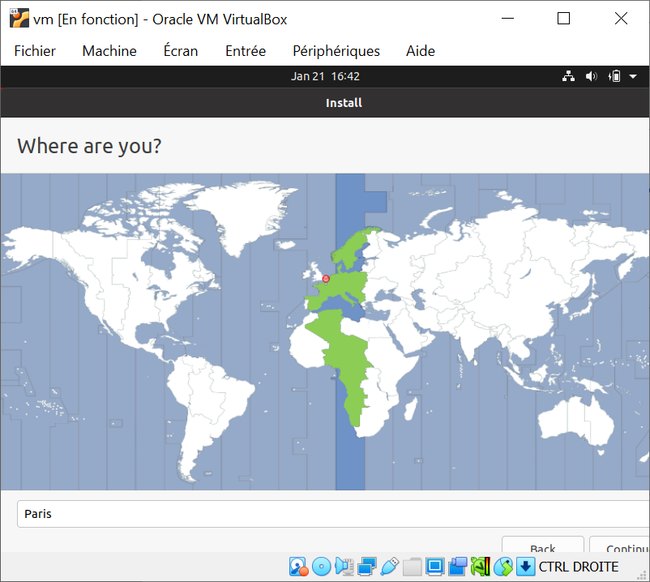

15. On choisi un nom d'utilisateur, le nom de la machine, et un mot de passe.

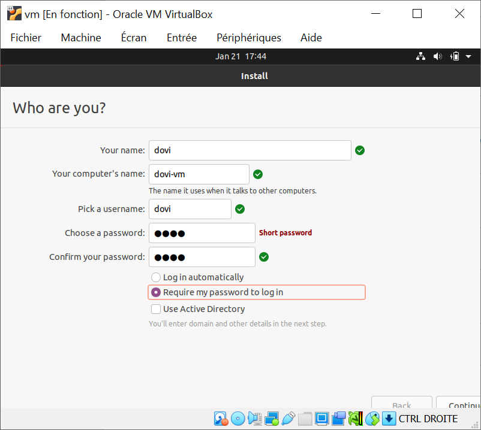

16. On laisse tourner l'instalateur jusqu'à la prochaine étape.

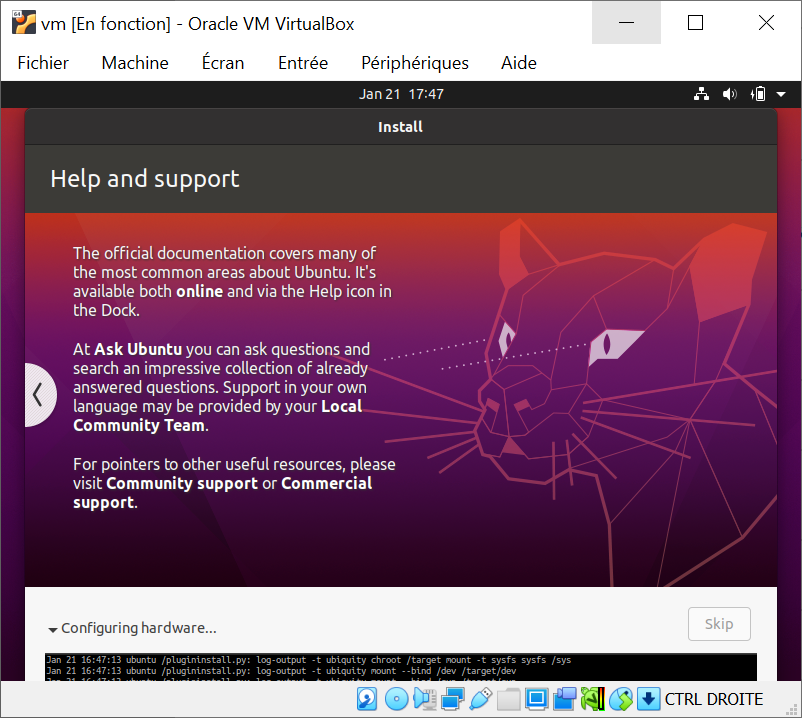

17. Une fois l'instalation terminée on redémare la machine.

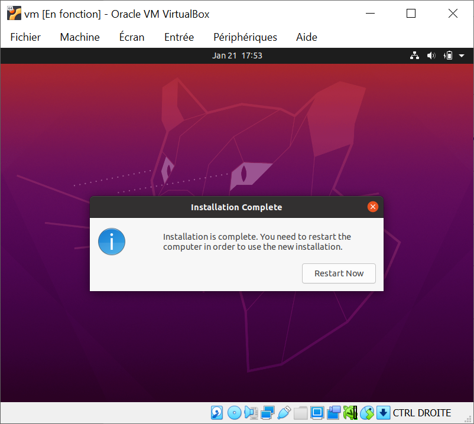

1.  Une fois redémarée un ouvre un terminal et on effectue une mise a jour complète avec la commande suivante.

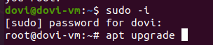

19. Et voilà comment votre machine est installée et mise à jour !

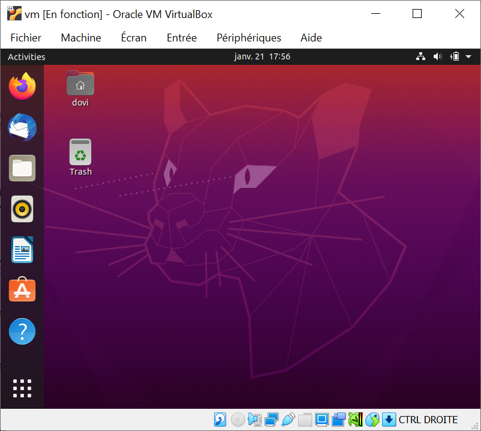
